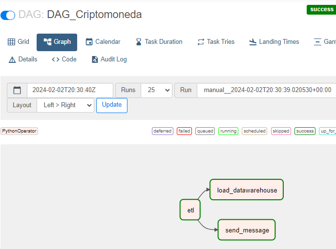
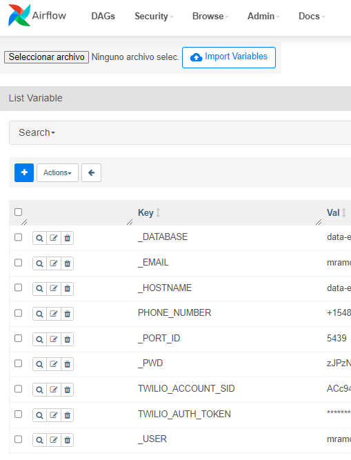

# AIRFLOW con AWS RedShift. Data Enginner

# Introduccion
Proyecto ETL y Automatizacion de Datawarehuse usando flujo de trabajo con Airflow y AWS RedShift como BD. Utilizamos una API de cryptomonedas como Data.

# DAGs 



Se ha diseñado dos archivos python:
- dags/cryptomoneda.py: Permite crear las tareas del DAGs
- dags/utils.py: Codigo detalle de proceso ETL y carga incrementa a la BD RedShift.

# Instrucciones de uso
1. Primero, clona este repositorio en tu máquina local.

2. Asegúrate de tener Docker y Python instalados en tu equipo.

3. Ejecuta el siguiente comando para levantar los servicios necesarios:

   ```bash
   docker-compose up -d
   ```
4. Abre tu navegador web y navega a la interfaz de usuario de Airflow. La URL por defecto es http://localhost:8080.

5. Utiliza las siguientes credenciales para iniciar sesión:

Usuario: admin
Contraseña: Obtener la Contraseña de Airflow: Utiliza el siguiente comando para obtener la contraseña de Airflow desde el contenedor del servicio web:
 
   ```bash
   docker exec -it [ID_DEL_CONTENEDOR_DEL_WEBSERVICE] cat standalone_admin_password.txt
   ```

6. Configurar Variables en Airflow




# Contacto
Miguel Angel Ramos Cañari: mramos.pe@gmail.com

Celular: +51952351404

LinkedIn: https://www.linkedin.com/in/miguel-angel-ramos-canari/
